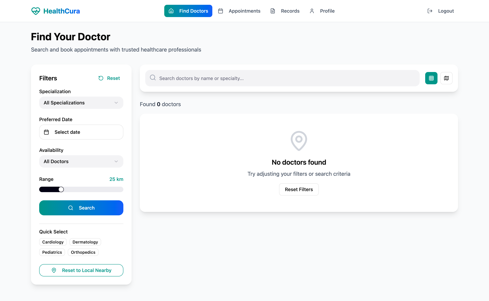
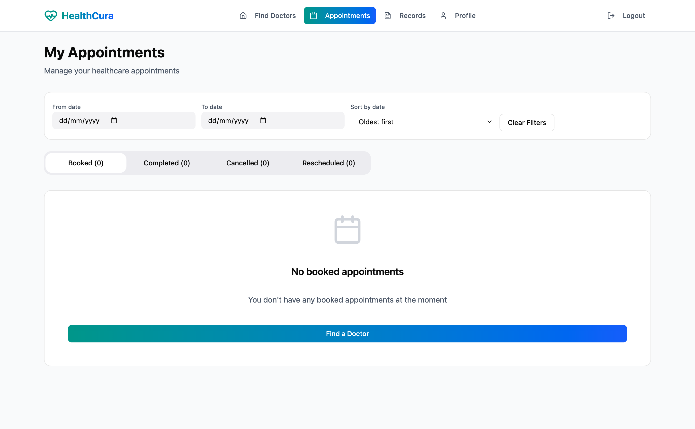
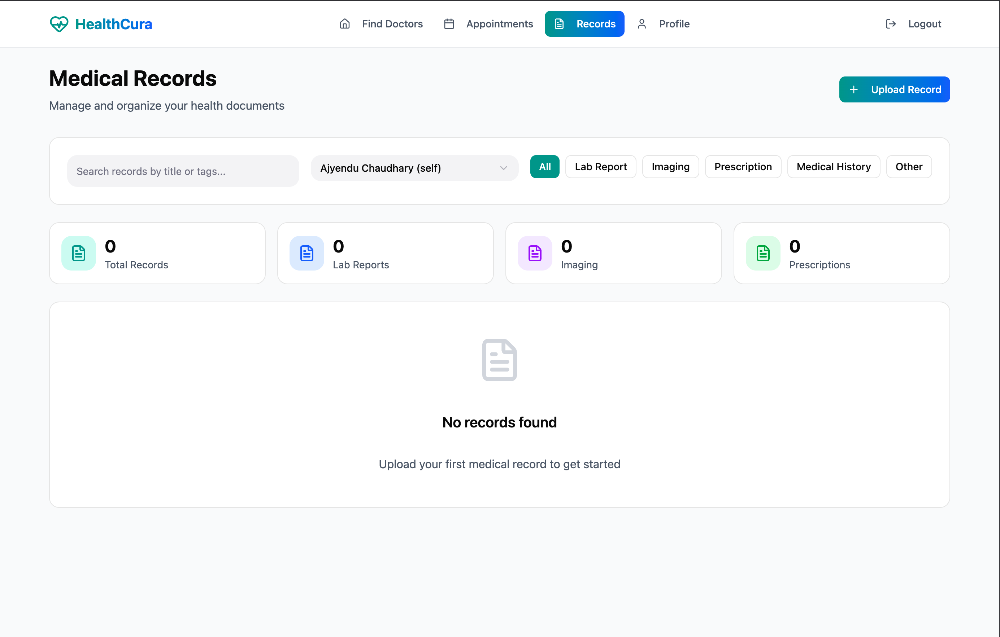
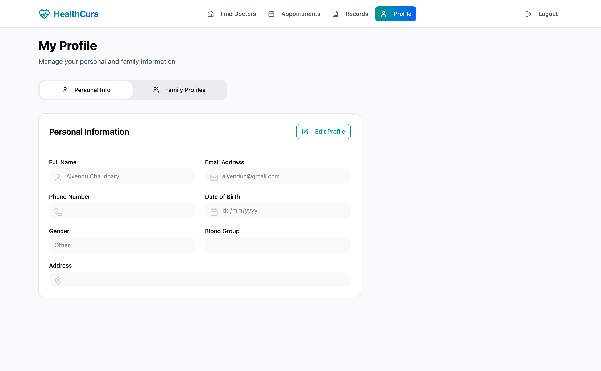
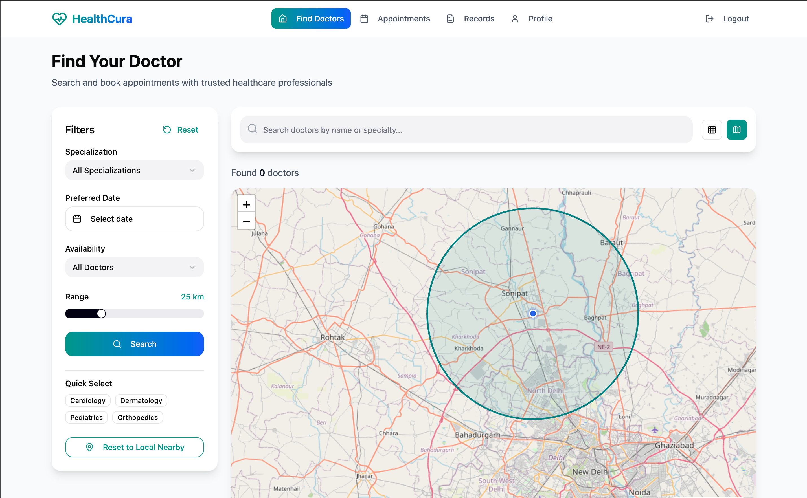
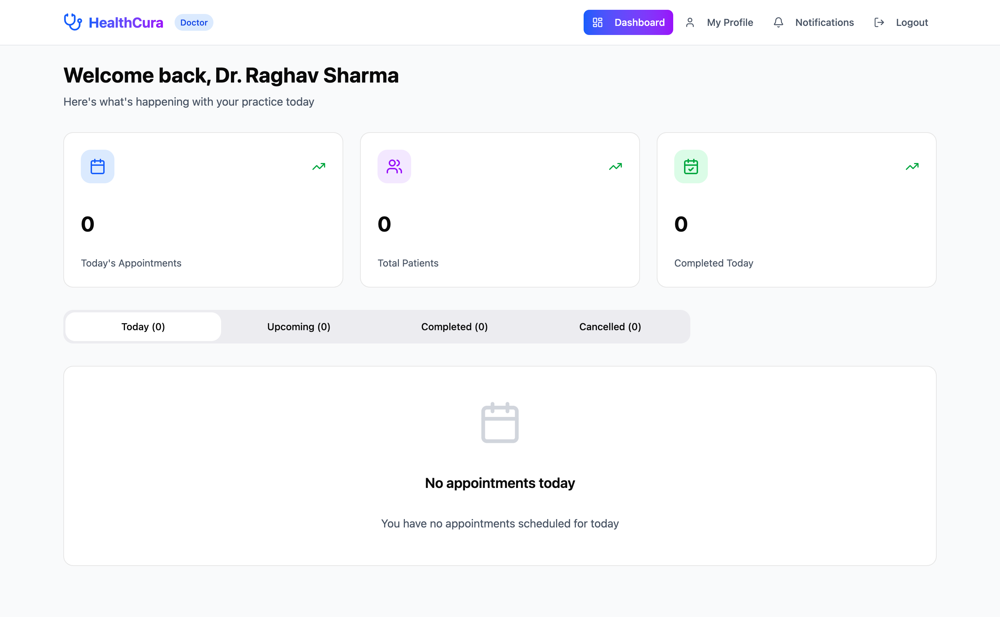
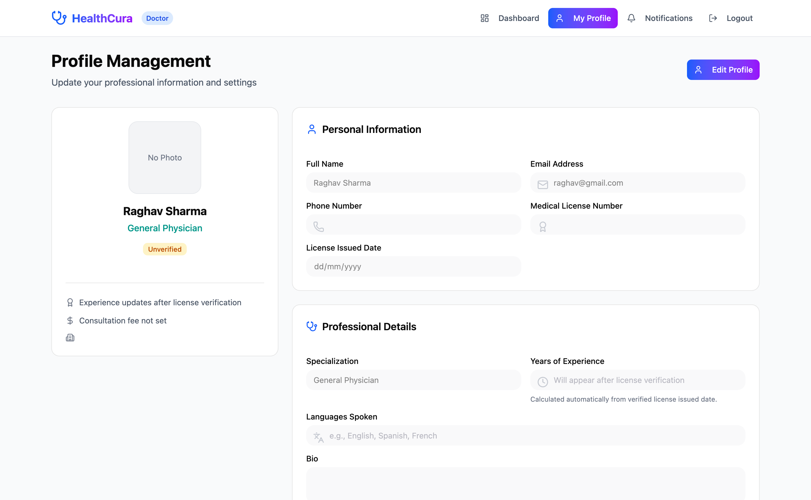
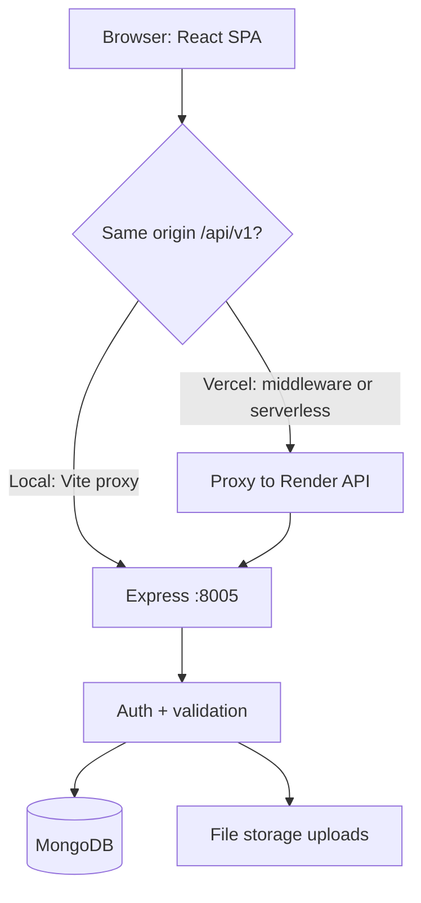
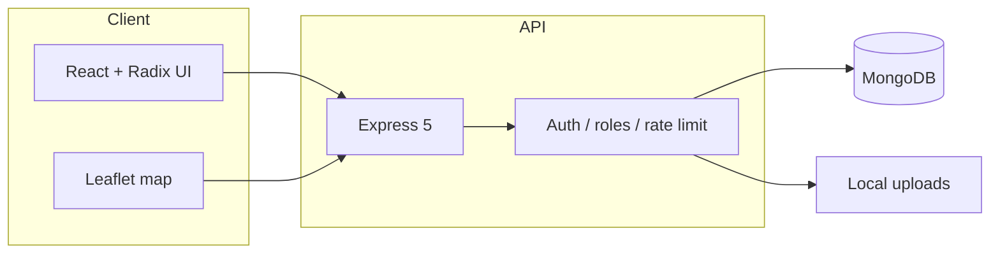

<div align="center">

# HealthCura

### Care, connected. Book doctors, manage visits, and keep records in one place.

A **full-stack healthcare web app** for patients and providers: discover doctors on a map, book appointments, and manage medical records—with **secure, role-based access**.

<br>


<br>


<br><br>

**Patients find care. Doctors manage their practice. Everyone stays in sync.**

</div>

---

## What is HealthCura?

HealthCura is a **monorepo** with a **React + Vite** client and an **Express + MongoDB** API. It supports:

- **Dual roles** — separate flows for **users (patients)** and **doctors**
- **JWT auth** stored in **httpOnly cookies** with role-aware route guards
- **Doctor discovery** with **Leaflet** maps and clustering
- **Appointments** — slot generation, booking, and conflict handling
- **Medical records** — uploads stored on the server under `backend/uploads`
- **REST API** under `/api/v1` (auth, users, doctors, appointments, medical records)

---

## Core features

<div align="center">

| Auth & profiles | Booking & care | Maps & discovery |
| ---------------- | -------------- | ------------------ |
| Register / login as user or doctor | Book available slots with validation | Browse doctors on an interactive map |
| Session via secure cookies | Appointment lifecycle for patients & doctors | Location-aware exploration |
| Role-based dashboards | Reason notes and scheduling rules | Clustered markers for scale |

</div>

<br>

<div align="center">

| Medical records | API & security | Dev experience |
| ----------------- | -------------- | ---------------- |
| File uploads tied to profiles | Rate limiting, Helmet, validation | One command runs full stack locally |
| Organized per patient context | CORS configured for deployed origins | Docker Compose for MongoDB |
| Doctor / user separation | bcrypt password hashing | ESLint, backend tests |

</div>

---

## Application gallery

<div align="center">

<table>
<tr>
<td></td>
<td></td>
</tr>
<tr>
<td></td>
<td></td>
</tr>
<tr>
<td></td>
<td></td>
</tr>
<tr>
<td colspan="2" align="center"></td>
</tr>
</table>

</div>

---

## Request flow (high level)



### Explanation

1. **Client** — Vite dev server or Vercel static build calls `/api/v1` (relative in production behind a proxy).
2. **Proxy** — Locally, Vite forwards to the backend; on Vercel, middleware or `api/*` forwards using `BACKEND_ORIGIN`.
3. **API** — Express routes under `/api/v1` for auth, users, doctors, appointments, and records.
4. **Data** — Mongoose models persist to MongoDB; uploads live under `backend/uploads`.

---

## System architecture



### Stack notes

- **Frontend** — React 18, Vite, TypeScript, Tailwind CSS, Radix UI, Font Awesome, React Leaflet.
- **Backend** — Express 5, Mongoose, express-validator, cookie-parser, JWT, bcryptjs, Helmet, rate limiting.
- **Deploy** — Frontend on **Vercel**; API on **Render** (or any Node host); set `FRONTEND_ORIGIN` and `BACKEND_ORIGIN` / `VITE_API_BASE_URL` consistently.

---

## Getting started

### Prerequisites

- **Node.js 18+**
- **MongoDB** (local, Atlas, or `docker compose` from this repo)

### Clone & install

```bash
git clone https://github.com/Ajyendu/Health-Cura.git
cd Health-Cura
npm install
```

Root `postinstall` installs **frontend** and **backend** dependencies.

### Environment

```bash
cp backend/.env.example backend/.env
cp frontend/.env.example frontend/.env
```

**Backend** (typical): `MONGO_URI`, `JWT_SECRET`, `PORT`, `FRONTEND_ORIGIN`, upload paths as documented in `backend/.env.example`.

**Frontend**: `VITE_API_BASE_URL` — e.g. `/api/v1` locally (with Vite proxy) or your deployed API base URL.

### MongoDB (optional, local)

```bash
npm run db:up
```

### Run full stack (development)

```bash
npm run dev
```

Starts the Vite client and the Express API (see root `package.json`).

### Other useful commands

```bash
npm run start          # API only (production-style)
npm run frontend       # Vite only
npm run backend        # API with nodemon
npm run build          # Production build of the frontend
npm run lint
npm run test:backend
npm run verify         # lint + build + backend tests
```

### API base URL

- Local default: `http://localhost:8005/api/v1`
- Auth uses **cookie-based JWT**; include credentials from the browser on same-origin or configured CORS origins.

---

## Project structure

| Path | Purpose |
| ---- | ------- |
| `frontend/` | React + Vite SPA |
| `backend/` | Express API and uploads |
| `Photos/` | README gallery images (`gallery-01.png` …) |
| `vercel.json` / `frontend/vercel.json` | Vercel build & routing |
| `docker-compose.yml` | Local MongoDB |

---

## Roadmap ideas

- Email / SMS reminders for appointments
- Video visit links
- Prescription history module
- Admin analytics dashboard
- E2E tests for critical flows

---

<div align="center">

## Author

**[Ajyendu](https://github.com/Ajyendu)**

If this project helps you, consider giving the repo a star.

</div>
